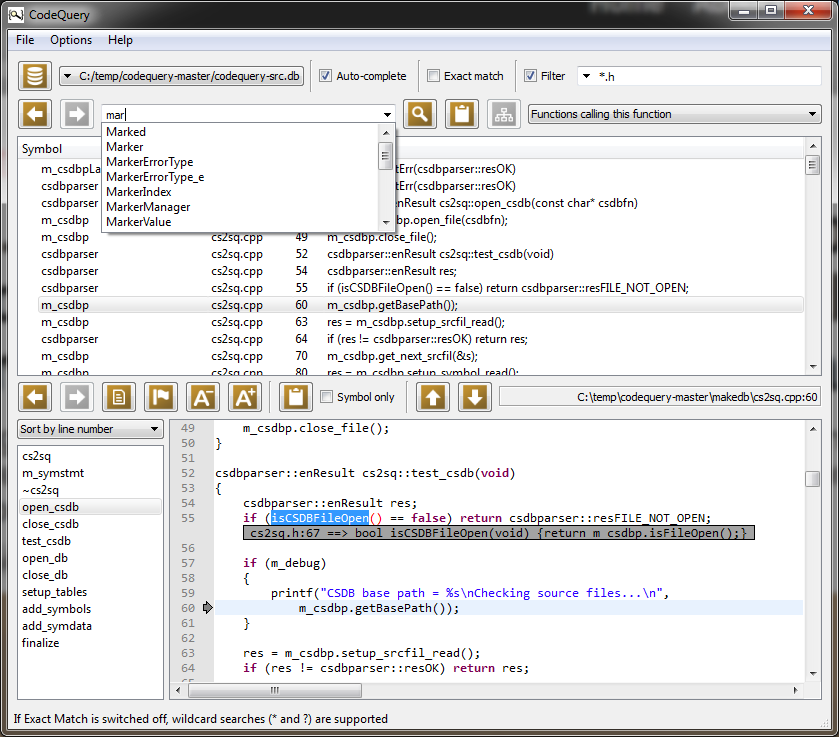
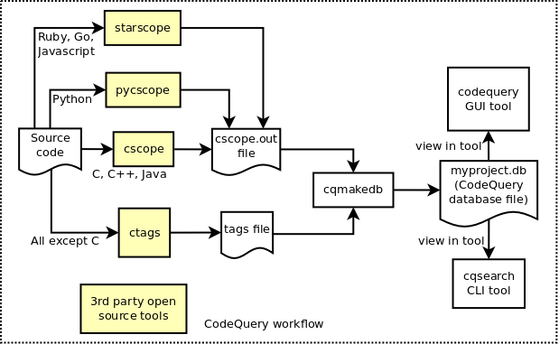

===============================

This is a tool to index, then query or search C, C++, Java, Python, Ruby, Go and Javascript source code.

It builds upon the databases of [cscope](http://cscope.sourceforge.net/) and [Exuberant ctags](http://ctags.sourceforge.net/). It can also work with [Universal ctags](https://github.com/universal-ctags/ctags/), which is a drop-in replacement for Exuberant ctags.

The databases of *cscope* and *ctags* would be processed by the *cqmakedb* tool to generate the CodeQuery database file.

The CodeQuery database file can be viewed and queried using the *codequery* GUI tool.

        
      

## Latest version = 0.22.0

**NOTE: Version 0.22.0 has fixes for a major performance bug in the GUI and in the ctags file parser.**

Windows and Linux binaries available here for download: [CodeQuery@sourceforge downloads](https://sourceforge.net/projects/codequery/files/)

To build on Linux, please read the [INSTALL-LINUX](doc/INSTALL-LINUX.md) file.

On Mac, the software can be installed through [Brew](http://brew.sh/) using `brew install codequery`.

Please read [NEWS](NEWS.md) to find out more.

## How is it different from cscope and ctags? What are the advantages?

Both cscope and ctags can do symbol lookup and identify functions, macros, classes and structs.

cscope is very C-centric, but is fuzzy enough to cover C++ and Java, but not very well for e.g. it doesn't understand destructors and class member instantiations. It can't provide relationships of class inheritance and membership. cscope can do "functions that call this function" and "functions called by this function". This is a very powerful feature that makes cscope stand out among comparable tools.

ctags does many languages well and understands destructors, member instantiations, and the relationships of class membership and inheritance. From ctags, we can find out "members and methods of this class", "class which owns this member or method", "parent of this class", "child of this class" etc. However, it doesn't do "functions that call this function" or "functions called by this function".

So both these tools have their pros and cons, but complement each other.

CodeQuery is a project that attempts to combine the features available from both cscope and ctags, provide faster database access compared to cscope (because it uses sqlite) and provides a nice GUI tool as well. Due to this faster database access, fast auto-completion of search terms and multiple complex queries to perform visualization is possible.

In addition, [pycscope](https://github.com/portante/pycscope) is used to add support for Python, in place of cscope.

In addition, [starscope](https://github.com/eapache/starscope) is used to add support for Ruby, Go and Javascript, in place of cscope.

## What features does CodeQuery have?

* Combines the best of both cscope and ctags
* Faster due to the use of sqlite for the CodeQuery database
* Cross-platform GUI tool
* Fast auto-completion of search term
* Case-insensitive, partial keyword search - wildcard search supported * and ?
* Exact match search
* Filter search results by file path
* File viewer with syntax highlighting, for UTF-8 encoded source files
* Ability to open viewed file in an external editor or IDE
* Visualization of function call graph and class inheritance based on search term
* Visualization graphs can be saved to PNG or Graphviz DOT files

## What types of query can I make?

* Symbol
* Function or macro definition
* Class or struct
* Functions calling this function
* Functions called by this function
* Calls of this function or macro
* Class which owns this member or method
* Members and methods of this class
* Parent of this class (inheritance)
* Children of this class (inheritance)
* Files including this file
* Full path for file
* Functions and macros inside this file
* Grep

## What does it look like?

## How does the visualization look like?

Here's a function call graph based on the search term of "updateFilePathLabel". A -> B means A calls B:    

## Are other editors like vim or emacs supported?

Yes! There is a vim plugin for CodeQuery called [vim-codequery](https://github.com/devjoe/vim-codequery) by [devjoe](https://github.com/devjoe). We welcome contributors to develop plugins for other editors too.

## What does it cost? How is it licensed?

It's freeware and free open source software.

This software is licensed under the [Mozilla Public License, version 2.0 (MPL-2.0)](https://www.mozilla.org/en-US/MPL/2.0/). See [LICENSE.md](LICENSE.md) or [LICENSE.txt](windows-install/LICENSE.txt). This applies to both the distributed Source Code Form and the distributed Executable Form of the software.

To understand the MPL-2.0 license, please read the [MPL-2.0 FAQ by mozilla.org](https://www.mozilla.org/en-US/MPL/2.0/FAQ/).

Files under the `querylib` directory are licensed under the [MIT license](http://opensource.org/licenses/MIT). See [QueryLib README](querylib/README.txt). This is a library to query CodeQuery database files. This library is MIT-licensed, so that it may be used to create plugins for editors, IDEs and other software without restrictions. It's only dependency is on sqlite3.

## Can I use it in a commercial environment without purchasing, for an unlimited time?

Yes. However, donations are welcomed.

## Which platforms are supported?

It has been tested on Windows 7 64-bit, Windows XP 32-bit, Mac OS X, Ubuntu and Fedora Linux 64-bit and, Ubuntu and Fedora Linux 32-bit.

Contributions are welcomed to attempt ports to other operating systems.

## Is the software available in other languages?

Yes. This applies only to the GUI tool.

Contributions are welcomed to update or provide new translations.

## How to install it?

On Windows, EXE setup packages will be provided here: [CodeQuery@sourceforge downloads](https://sourceforge.net/projects/codequery/files/). The EXE setup package shall also contain cscope.exe, ctags.exe and the required DLLs. So, everything you need is in one package. However, [pycscope](https://github.com/portante/pycscope) (optional - only for Python) and [starscope](https://github.com/eapache/starscope) (optional - only for Ruby, Go and Javascript) are not bundled together with this setup package and need to be installed separately.

On Linux, tar.gz, RPM and Debian package installations will be provided here: [CodeQuery@sourceforge downloads](https://sourceforge.net/projects/codequery/files/).

On Mac, the software can be installed through [Brew](http://brew.sh/) using `brew install codequery`.

To build on Linux and Mac, please read the [INSTALL-LINUX](doc/INSTALL-LINUX.md) file.

Version 15.8a of [cscope](http://cscope.sourceforge.net/) or higher, works best with CodeQuery.

## How do I use it?

On Windows: [HOWTO-WINDOWS](windows-install/HOWTO-WINDOWS.txt). This file is included in the EXE setup package.

On Linux and Mac: [HOWTO-LINUX](doc/HOWTO-LINUX.md)

Please read the HOWTO file provided for each platform. The workflow looks like this:

## How do I generate whole-program call graphs or UML class diagrams?

CodeQuery cannot do this at the moment.

To generate whole-program call graphs, please use [GNU cflow](https://www.gnu.org/software/cflow/) or [CodeViz](https://github.com/petersenna/codeviz) for C and C++. For Java, there is [Javashot](http://code.google.com/p/javashot/). 

To generate whole-program UML class diagrams for various object-oriented languages, please use [tags2uml](https://github.com/ruben2020/tags2uml). 

## Are there any known limitations?

For C and C++, [inline assembly code](http://en.wikipedia.org/wiki/Inline_assembler) is not supported by all the tools. This mainly affects embedded software, OS and driver code.

Please exclude files with inline assembly code from the list of files (cscope.files) to be scanned.

## How do I contact the authors for support, issues, bug reports, fix patches, feature requests etc.?

Please see the email address below, and also the Issues tab in GitHub.

Email address:    

Website: [CodeQuery website](https://github.com/ruben2020/codequery)

## How can I contribute?

* Report bugs
* Provide feedback, new ideas, suggestions etc. What would you like to see?
* Tell your friends, recommend it on StackOverflow or social media
* Fix bugs (see Issues tab)
* Update translations (Deutsch, Francais, Japanese etc.)
* Port to other platforms
* Write plugins for emacs, eclipse, Notepad++, NetBeans, Jenkins etc.
* Add support for other languages e.g. Objective-C, Swift

## List of Contributors

[ruben2020](https://github.com/ruben2020)    
[naseer](https://github.com/naseer)    
[bruno-](https://github.com/bruno-)    
[devjoe](https://github.com/devjoe)    
[jonashaag](https://github.com/jonashaag)    
[ilovezfs](https://github.com/ilovezfs)    
[JCount](https://github.com/JCount)    
[brianonn](https://github.com/brianonn)    
[teungri](https://github.com/teungri)    
(More welcomed)

## Credits

We thank the people behind the following projects:    
[cscope](http://cscope.sourceforge.net/) - our database is derived from this   
[Exuberant ctags](http://ctags.sourceforge.net/)- our database is derived from this   
[Universal ctags](https://github.com/universal-ctags/ctags/) - drop-in replacement for Exuberant ctags    
[pycscope](https://github.com/portante/pycscope) - our database (for Python) is derived from this    
[starscope](https://github.com/eapache/starscope) - our database (for Ruby, Go and Javascript) is derived from this    
[sqlite3](http://www.sqlite.org/) - our database is using this format    
[CMake](http://www.cmake.org/) - cross-platform build toolchain for CodeQuery    
[Qt open source](http://qt-project.org/) - GUI toolkit used to build CodeQuery    
[showgraph](http://code.google.com/p/showgraph/) - visualization done using this library    
[scintilla](http://www.scintilla.org/) - our code editing widget    
[vim-codequery](https://github.com/devjoe/vim-codequery) - vim plugin for CodeQuery    
[Axialis](http://www.axialis.com/iconworkshop) - free images for CodeQuery and this website    
[brew](http://brew.sh/) - binaries for Mac here    

